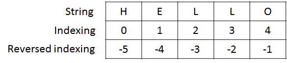
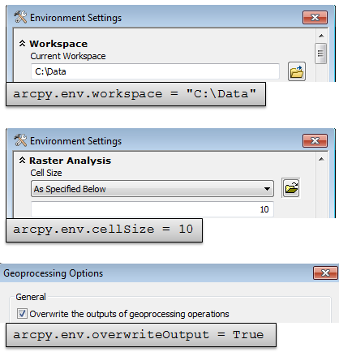
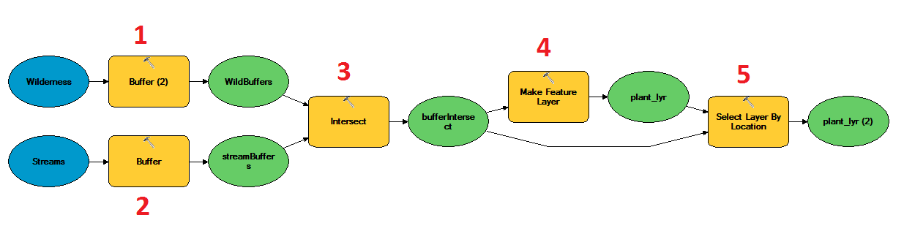

# Python Basics

# Python
* One of the most popular programming language in academia
* Easy to learn/read/use
* Abundant open-source packages for spatial analysis, statistics, data mining, and visualization 
* Large user group - you are not alone
* Reproducable science - executable documentation of your research
* Drawback: interpreted language - not as fast compiled languages (C, Fortran)

# Python Interface of ArcGIS

* Another way to use ArcGIS functionalities (other than ModelBuilder and manual manipulation)
* Chain and execute the geoprocessing tools in a logical sequential
* Highly customizable - you can combine your program and ArcGIS built-in processing tools
* Python scripts can be run as 
	* commands in ArcGIS console
	* an external Python editor (an integrated development evironment, or IDE).
* Drawbacks: 
    * Not free (you need license) and not open-source (blackbox)

# Python Console in ArcGIS


* Easy to use (no need to open another editor)
* Interactive - see results when enter a line (like a command)


# An External Python Editor
* Integrated Development Environment or IDE
* More functionalities that help programming
* [10 Best Python Editors](http://noeticforce.com/best-python-ide-for-programmers-windows-and-mac) 
	* Pydev with Eclipse
	* Best Python IDE
	* PyCharm
	* VIM
	* Wing IDE. 
	* Spyder Python. 
	* Komodo IDE. 
	* PTVS 
	* Eric Python.

# The Interface of IDE


# 1 Basics of Python

## 1.1 Numbers
### Assign values
#### You don't need to explicitly declare the type of variables. Python will decide the variable type from the assigned value.


```python
a = 10
b = 10.0
print(type(a))
print(type(b))
```

    <type 'int'>
    <type 'float'>
    

#### Python is case sensitive


```python
variable = 100
print variable
```

    100
    

#### Expression syntax is straightforward: e.g. +, -, * and /


```python
2 + 2
```


    4


#### * / are of higher precedence than + -


```python
5 + 6 / 3
```


    7


```python
((50 - 5) * 6) / 4 # use parenthesis to define the precedence of operators
```


    67


#### Other expressions


```python
17 // 3  # floor division discards the fractional part
```


    5


```python
5**2 #power
```


    25


## 1.2 Strings

#### Strings can be enclosed in single quotes ('...') or double quotes ("...") with the same result


```python
# Declare 3 variables
a = 'Hello'
b = "World"
c = 3
```

#### Strings can be concatenated by '+'


```python
a + b
```


    'HelloWorld'


#### Strings and numbers cannot be directly concatenated. You  need to convert number into string


```python
a + c
```


    ---------------------------------------------------------------------------

    TypeError                                 Traceback (most recent call last)

    <ipython-input-123-ca57d551b7f3> in <module>()
    ----> 1 a + c
    

    TypeError: cannot concatenate 'str' and 'int' objects


```python
a + str(c)
```

#### Strings are essentially lists of letters/symbols


```python
a[0]
```


    'H'


```python
a[2:4]
```


    'll'


##  1.3 Lists: 
#### Written as a list of comma-separated values (items) between square brackets.


```python
# Declare a list of numbers
squares = [1,4,9,16,25]
str1=["H","e","l","l","o"]
comb = [1,'a',2,'b',3,'c']
```

#### The indexing of Python list is from 0 to n-1.
#### Or the reversed indexing is from -1 to -n



```python
squares[0] # In Python, the first item is indexed as 0
```


    1


```python
squares[-1] # Index -1 refers to the last item
```


    25


```python
squares[2:4]
```


    [9, 16]


```python
str1[-5:-2]
```


    ['H', 'e', 'l']


str1[-1:-3]

#### Lists might contain items of different types, but usually the items all have the same type.


```python
comb = [1,'a',2,'b',3,'c']
```


```python
print(type(comb[0]))
print(type(comb[1]))
```

    <type 'int'>
    <type 'str'>
    


```python
str1[-2:-1]
```


    ['l']


#### Use append() to add items at the end of the list


```python
a=[] # Create an empty list
a.append(1)
print(a)
a.append('b')
print(a)
a.append(3)
print(a)
```

    [1]
    [1, 'b']
    [1, 'b', 3]
    

#### Shallow copy and hard copy
* If b is a compound objects (e.g. list, array), `A = B` means a *shallow copy* from A to B
* *Shallow copy* is making a reference from B to A, **not** copying the value from A to B.
* You will need to use copy.deepcopy to copy the value from A to B.


#### Create a list 'L1' and then copy 'L1' to 'L2':


```python
L1 = [1,2,3]
L2 = L1
print(L2)
```

    [1, 2, 3]
    

#### Then change the first element of L1, L2 will update automatically. Because L2 is a shallow copy of L1


```python
L2[1] = 100
print('L1: ',L1)
print('L2: ',L2)
```

    ('L1: ', [1, 100, 3])
    ('L2: ', [1, 100, 3])
    

#### You need to use `copy.deepcopy` to copy the value of A to B


```python
import copy
L1 = [1,2,3]
L2 = copy.deepcopy(L1)
L1[0] = 4
print('L1: ',L1)
print('L2:',L2) 
```

    ('L1: ', [4, 2, 3])
    ('L2:', [1, 2, 3])
    

## 1.4 Control Flow Statements
#### "*if*"Statement
* Do different things according to if certain conditions hold true.
* You can use multiple conditions


```python
1 < 3
```


    True


```python
x = int(input("Please enter an integer: "))

if x < 0:
    print ('Negative')
elif x == 0: # Note this is not '='
    print ('Zero')
elif x==1:
    print ('Single')
else:
    print('More')
```

    Please enter an integer: 5
    More
    

* Recommend: very condition is exclusive to the others
* If more than one condition are meet, do things in the first condition


```python
x = int(input("Please enter an integer: "))

if x <5:
    print ('x is smaller than 5')
elif x>3:
    print ('x is greater than 3')
```

    Please enter an integer: 5
    x is greater than 3
    

#### '*for*' statement
Iterate through every element in a list


```python
words = ['cat', 'window', 'defenestrate'] # Create a list of 3 strings
for letter in words:
    print(letter,len(letter))
```

    ('cat', 3)
    ('window', 6)
    ('defenestrate', 12)
    

The following function range(a,b) creates a list of numbers from a to (b-1), then the for loop iterates through all numbers in the list.


```python
for i in range(1,10): # range defines a list from 1 to 10
    print i*2
```

    2
    4
    6
    8
    10
    12
    14
    16
    18
    

#### '*while*' statement
Repeat the same action if the condition hold true


```python
a = 0
while a < 10: # if a is smaller than b, repeat the following action
    print a
    a = a + 1
```

    0
    1
    2
    3
    4
    5
    6
    7
    8
    9
    

## 1.5 Function
* A function is a block of organized, reusable code that is used to perform a single, related action. 
* A function typically takes some input variables/parameters and produce output (but not necessarily).
* Python function is represented as 'FUN_NAME(ARG1,ARG2,...)'
* All geoprocessing tools in arcpy are functions.

#### Declare a function

Wrap a block of code into a function.

Given several lines of code


```python
print("Happy Birthday to you!")
print("Happy Birthday to you!")
print("Happy Birthday, dear Emily.")
print("Happy Birthday to you!")
```

    Happy Birthday to you!
    Happy Birthday to you!
    Happy Birthday, dear Emily.
    Happy Birthday to you!
    

You can wrap the code into a function


```python
def happyBirthdayEmily(): #program does nothing as written
    print("Happy Birthday to you!")
    print("Happy Birthday to you!")
    print("Happy Birthday, dear Emily.")
    print("Happy Birthday to you!")
```

Then call the function


```python
happyBirthdayEmily()
```

    Happy Birthday to you!
    Happy Birthday to you!
    Happy Birthday, dear Emily.
    Happy Birthday to you!
    

Declare a function calculate the summation of two input variables


```python
def sumProblemString(x, y):
    sum = x + y
    return sum
```

#### Call a function
Arrange input variables in () in the same order as declared 


```python
output = sumProblemString (243532,23423)
print(output)
```

    266955
    

# 2 Steps of using 'arcpy' for geoprocessing
1. Import arcpy - make tools in arcpy ready to use
2. Set environments - Define default settings used in your script
3. Link data - specify the path of your data individually or by *Lists*
4. Specify variables and parameters of geoprocessing tools
5. Define an execution order of the tools

## Step 1: import arcpy


```python
import arcpy
```

##    Step 2: Set Environments (Set default values for your program)
#### Set current workspace - specify the default input/output folder


```python
arcpy.env.workspace = "C:/Student/PythonGP10_0/Data/SanJuan.gdb"
print(arcpy.env.workspace)
```

    C:/Student/PythonGP10_0/Data/SanJuan.gdb
    

#### set the default cellsize:


```python
arcpy.env.cellsize = 10
print(arcpy.env.cellsize)
```

    10
    

#### Overwrite the output or not:


```python
print(arcpy.env.overwriteOutput)
```

    True
    


```python
arcpy.env.overwriteOutput = True
```


```python
print (arcpy.env.overwriteOutput)
```

    True
    

#### The above scripts are equal to the following manual settings in ArcGIS:


#### Describe the properties of your data


```python
desc = arcpy.Describe("C:\Student\PythonGP10_0\Data\SanJuan.gdb\Forest")
print(desc)
```


    ---------------------------------------------------------------------------

    IOError                                   Traceback (most recent call last)

    <ipython-input-155-a5fb6af71e33> in <module>()
    ----> 1 desc = arcpy.Describe("C:\Student\PythonGP10_0\Data\SanJuan.gdb\Forest")
          2 print(desc)
    

    C:\Program Files (x86)\ArcGIS\Desktop10.5\arcpy\arcpy\__init__.py in Describe(value)
       1251          value(String):
       1252        The specified data element or geoprocessing object to describe."""
    -> 1253     return gp.describe(value)
       1254 
       1255 def CreateObject(name, options=None):
    

    C:\Program Files (x86)\ArcGIS\Desktop10.5\arcpy\arcpy\geoprocessing\_base.py in describe(self, *args)
        374         from ..arcobjects.arcobjectconversion import convertArcObjectToPythonObject
        375         return convertArcObjectToPythonObject(
    --> 376                     self._gp.Describe(*gp_fixargs(args, True)))
        377     def createObject(self, *args):
        378         """GP function CreateObject"""
    

    IOError: "C:\Student\PythonGP10_0\Data\SanJuan.gdb\Forest" does not exist


```python
print desc.shapeType
```


```python
print desc.spatialReference.Name
```

## Step 3: Link to Data
#### Option 1: Link to data individually using path
Link 'Streams' variable to the streams shapefile and print the shape type: 


```python
Streams="C:/Student/PythonGP10_0/Data/SanJuan.gdb/streams"
desc = arcpy.Describe(Streams)
print (desc.shapeType)
```

Or, you can only write the portion of the path under the workspace


```python
arcpy.env.workspace = "C:/Student/PythonGP10_0/Data/SanJuan.gdb"
Streams="streams"
desc = arcpy.Describe(Streams)
print (desc.shapeType)
```

#### Option 2: Creating lists of GIS data
* List all GIS data in the workspace - you need to specify the workspace in advance
* Represent GIS data in an ordered collection
* You can freely add, remove and sort items in the list

|Function name|Type of list|
|---|---|
|ListDatasets|Returns the datasets in the current workspace|
|ListFeatureClasses|Returns the feature classes in the current workspace|
|ListFields|Returns a list of attribute fields|
|ListRasters|Returns a list of rasters found in the current workspace|
|ListWorkspaces|Returns a list of workspaces within the current workspace|

#### A list of feature classes is created from the contents of "U:/Data/SanJuan.gdb"


```python
arcpy.env.workspace="C:/Student/PythonGP10_0/Data/SanJuan.gdb"
fcList = arcpy.ListFeatureClasses()
```

#### Use a *for* loop to iterate through the list and print the name of each item


```python
for fc in fcList:
    desc = arcpy.Describe(fc)
    print desc.baseName
```

### Step 4: Specify variables/parameters for geoprocessing tools
* All geoprocessing tools in ArcGIS can be used through Python (arcpy)
* Geoprocessing tools are wrapped as functions with inputs and output
* You can find the Python syntax of tools in ESRI Documentation or use 'Usage' function
* You need to specify the input/output variables of the tools in order to run

#### Specify input/output variables, parameters for the Buffer tool:


```python
inFeatures = "Roads"
outBuffers = "RoadBuffers"
# You can also use absolute path: 
# outBuffers = C:/Student/PythonGP10_0/Data/SanJuan.gdb
buffField = "1000 feet"
arcpy.Buffer_analysis(inFeatures, outBuffers, buffField)
```

#### Check if the buffer is created.


```python
fcList = arcpy.ListFeatureClasses()
for fc in fcList:
    desc = arcpy.Describe(fc)
    print desc.baseName
```

* #### You can find python syntax of tools from ESRI documentation (google or toolbox)
* #### Drag the tool from toolbox into ArcGIS Python console
* #### Or use 'Usage' function


```python
arcpy.Usage("Buffer_Analysis")
```

## Step 5: Define an execution order of your tools
#### For example, you define a workflow to find all invasive plants within 2000 meters from streams and 5000 meters from the wilderness
#### 1. Create 3000 buffer for streams


```python
inFeatures1 = "streams"
outBuffers1 = "streamBuffers"
buffField1 = "3000 meter"
arcpy.Buffer_analysis(inFeatures1, outBuffers1, buffField1)
```

#### 2. Create 5000m buffer for the wilderness


```python
inFeatures2 = "Wilderness"
outBuffers2 = "WildBuffers"
buffField2 = "5000 meter"
arcpy.Buffer_analysis(inFeatures2, outBuffers2, buffField2)
```

#### 3. Make an intersection of the two buffers


```python
arcpy.Intersect_analysis([outBuffers1,outBuffers2], "bufferIntersect")
```

#### 4. Create a feature layer for *invasive_plants*
Because SelectLayerByLocation tool only works with feature layers, so you need to create a feature layer for the buffer intersect first.


```python
arcpy.MakeFeatureLayer_management("invasive_plants", "plant_lyr")
```

#### 5. Select invasive plants in the buffer intersection


```python
arcpy.SelectLayerByLocation_management ("plant_lyr", "WITHIN", "bufferIntersect")
# Get total number of invasive plants within the buffer intersection
matchcount = int(arcpy.GetCount_management('plant_lyr')[0])
print('The number of selected invasive plants are ' + str(matchcount)) # print it out

```

#### The above workflow can also be built in ModelBuilder


